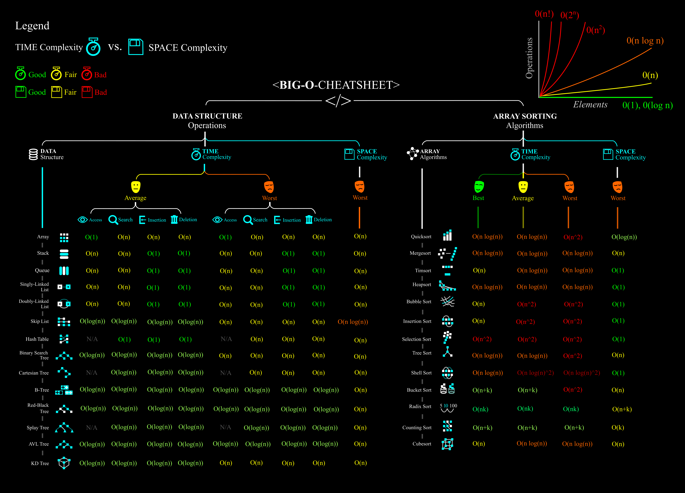

# INTERVIEWS
Code, IDEs, Tools utilized during interviews.

# IDE
Basically if the problem is:
* JavaScript they use JSFiddle.net
* React or Angular they use CodeSandBox.io
* Visual Studio Code is used for all of them too.

| Language | JSFiddle.net | Plnkr.co | codesandbox.io |
| --- | --- | --- | --- |
| JavaScript | Yes | Yes | Yes |
| React | No | ? | Yes |
| Angular | No | ? | Yes |

## JSFiddle.net
* Add libraries with `Resources > cdnjs` for jQuery, and others.
* Result has a Console (Beta) for `console.log()`

## CodeSandBox.io
* Angular Template: https://codesandbox.io/s/angular
* React Template: https://codesandbox.io/s/react-new

# JAVASCRIPT

```javascript

// What values will boo and bar have at the end?

const ar1 = [7,15,10,2,8,1,7,0];
const ar2 =[0,0,0];

const foo = [...ar1]
    .filter((a) => a % 2 ===1)
    .sort()
    .slice(0,2)
    .map((a) => a + 5)
    .some((a) => a > 15);

const bar = ar1.concat(ar2) === [...ar1, ...ar2] ||
        ar1.reduce((a,b) => a * b, 1) === ar2.reduce((a,b) => a+b,1);

console.log(foo);   // true
console.log(bar);   // false

```

# NODEJS

# REACT

```javascript
// Make a Textarea for the results, and 2 buttons (Previous and Next).
// Everytime user press Next or Previous there is a REST call to endpoint:
// http://jsonplaceholder.typicode.com/posts/1
// Where 1 == User ID.
// When Next User ID = 2, and REST must reflect that http://..etc..../posts/2
// The Endpoint answer with User info in JSON.
// Show the User info in TextArea.
// Previous must go previous
```

# ENDPOINTS / JSON / API

## jsonplaceholder.typicode.com
Fake REST API that returns request of type GET/POST for testing.
* GET URL example: `http://jsonplaceholder.typicode.com/posts/1` where `1`== userId will return JSON with some user information.

# BENCHMARKING
There are tools to measure how fast or how much storage algorithms perform.Most of them use `benchmark.js` as library.
* Benchmark.js (Recommended) to use it locally: https://benchmarkjs.com/
* JSPerf (often down)
* JSBench.me
* MeasureThat.net
* JSFiddle template ready to go: https://jsfiddle.net/533hc71h/
* JSFIddle template improved: https://jsfiddle.net/2e8fcuhb/2/
* Plunker template: https://plnkr.co/edit/pJg5LsiSNqlc6immmGsW?preview

# ALGORITHMS
**Big-Oh Notation**
Gives worst-case scenario of an algorithm complexity in terms of `Time` or `Space`.
| Big-Oh | Complexity | Description |
| --- | --- | --- |
| O(1) | Constant | Fastest or Best |
| O(log n) | Logarithmic | Proportional to input size in terms of log |
| O(n) | Linear | Proportional to input size |
| O(n log n) | Log-Linear / QuasiLinear | Proportional to input size and a logarithmic factor |
| O(n^2) | Square / Polinomial | Bad, Proportional to square, cubic, polinomial |
| O(2^n) | Exponential | |
| O(n!) | Factorial | Worst of the Worst| 

* `Time` Complexity: Number of operations performed by algorithm in big-Oh notation. Less number of operations == most efficien.
* `Space` Complexity: Storage needed by an algorithm in big-Oh notation. 



## Fibonacci
Given a number N return the index value of the Fibonacci sequence, where the sequence is `[1, 1, 2, 3, 5, 8, 13, 21, 34, 55, 89, 144, ...]`


```javascript
    // Solution 1 - While
    // Time Complexity = O(n) OK
    // Space Complexity = O(1)
function fibonacci_1(num) {
    var a = 1, b = 0, temp;
    while (num >= 0) {
        temp = a;
        a = a + b;
        b = temp;
        num--;
    }
  return b;
}
    // Solution 2 - Recursive
    // Time Complexity = O(2^N) REALLY BAD
    // Space Complexity = O(n)
function fibonacci(num) {
    if (num <= 1)
        return 1;
    return fibonacci(num - 1) + fibonacci(num - 2);
}

    // Solution 3 - Hash / Memoization
    // Time Complexity = O(n) OK
    // Space Complexity = O(n)
function fibonacci(num, memo) {
    memo = memo || {};

    if (memo[num]) return memo[num];
    if (num <= 1) return 1;

    return memo[num] = fibonacci(num - 1, memo) + fibonacci(num - 2, memo);    

```

* https://medium.com/developers-writing/fibonacci-sequence-algorithm-in-javascript-b253dc7e320e